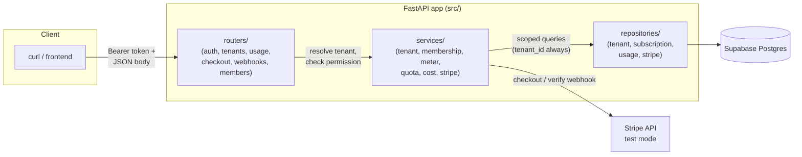
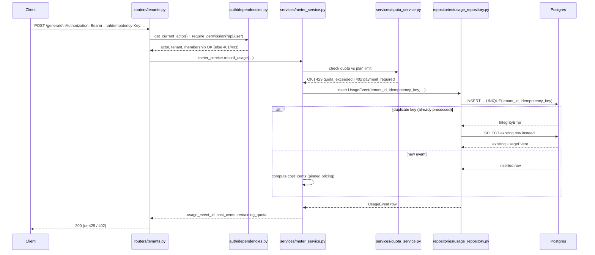
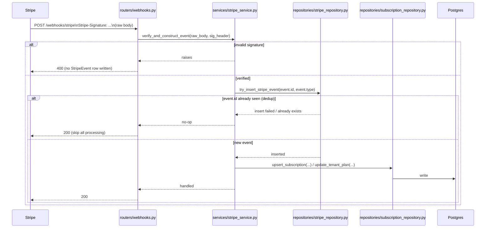

# Usage Metering & Billing Engine

FlyRank capstone project: a FastAPI backend that meters per-tenant API/AI-
token usage, enforces plan quotas, computes cost in integer cents, and
syncs subscription state via Stripe (test mode) webhooks — all idempotent
under retries, with multi-tenant authorization (User/Membership/Role/
Permission) backed by Supabase Auth.

## Stack

- **API**: FastAPI
- **DB + Auth**: Supabase (Postgres, wire-compatible; Supabase Auth for
  bearer tokens)
- **Payments**: Stripe, test mode only
- **Package manager**: [uv](https://docs.astral.sh/uv/)
- **Tests**: pytest, in-memory SQLite fixtures (no live Supabase project
  needed to run the suite)

Architecture rule (enforced throughout `src/`): **routers → services →
repositories**, strict layering, no skipping. See `.claude/docs/DESIGN.md`
and `.claude/docs/AUTHZ_DESIGN.md` for the full request-flow spec.

## Quickstart

### 1. Configure environment

```bash
cp .env.example .env
```

Fill in:

| Variable | Where to find it |
|---|---|
| `DATABASE_URL` | Supabase Dashboard → Settings → Database → Connection string (URI) |
| `SUPABASE_URL` | Supabase Dashboard → Settings → API |
| `SUPABASE_ANON_KEY` | Supabase Dashboard → Settings → API |
| `SUPABASE_SERVICE_ROLE_KEY` | Supabase Dashboard → Settings → API (server-side only, never expose to clients) |
| `SUPABASE_JWT_SECRET` | Supabase Dashboard → Settings → API → JWT Settings → JWT Secret |
| `STRIPE_SECRET_KEY` | Stripe Dashboard (test mode) → Developers → API keys |
| `STRIPE_WEBHOOK_SECRET` | Stripe CLI (`stripe listen --print-secret`) or Dashboard → Webhooks |
| `STRIPE_PRICE_ID_PRO` | Stripe Dashboard (test mode) → Products → your Pro price |

Never commit `.env` — see `CLAUDE.md`.

### 2. Run the app

```bash
docker compose up --build
```

This builds the image (`Dockerfile`), starts the container, and the app
creates any missing DB tables against `DATABASE_URL` on startup (see
"Database schema" below — this is a dev/test convenience; the real source
of truth going forward is Alembic migrations).

App is now reachable at `http://localhost:8000`. Interactive API docs:
`http://localhost:8000/docs`.

**Without Docker**, using `uv` directly:

```bash
uv sync
uv run uvicorn src.main:app --host 0.0.0.0 --port 8000
```

### 3. Seed demo data

```bash
uv run python scripts/seed.py
```

Creates a demo tenant ("Acme Demo"), a demo user, and an admin
`Membership` — idempotent, safe to re-run. Prints a `tenant_id` and a
ready-to-use bearer token you can immediately curl with:

```bash
curl -s http://localhost:8000/tenants/<tenant_id>/usage \
  -H "Authorization: Bearer <token printed by the seed script>"
```

See `.claude/docs/SEED_SCRIPT_DESIGN.md` for exactly how the demo token is
minted and what to do if your Supabase project uses asymmetric (JWKS)
signing instead of an HS256 shared secret.

### 4. Run the tests

```bash
uv run pytest
```

Tests build their own in-memory SQLite database per test
(`tests/conftest.py`) and sign their own Supabase-shaped JWTs against a
fixed test secret — no live Supabase project or network access required.

```bash
uv run pytest --cov=src --cov-report=term-missing   # with coverage
```

### 5. Database migrations

Schema changes are managed with Alembic (design: see
`.claude/docs/MIGRATIONS_DESIGN.md`):

```bash
uv run alembic upgrade head                         # apply migrations
uv run alembic revision --autogenerate -m "..."      # after changing db_models.py
```

### 6. Background job — subscription reconciliation

Stripe webhooks are the fast path for syncing subscription state
(`checkout.session.completed`, `customer.subscription.updated`,
`customer.subscription.deleted` — see `.claude/docs/API_CONTRACTS.md`).
The reconciliation job is the slow-path safety net: it polls Stripe for
every tenant's true subscription status and corrects local drift caused by
a missed or delayed webhook delivery, with retry-with-backoff and a
CRITICAL-log + `AuditLog` failure alert. Design: see
`.claude/docs/BACKGROUND_JOBS_DESIGN.md`.

```bash
uv run python -m src.jobs.reconcile_subscriptions   # run once, on demand
```

Recommended schedule (host cron, every 6 hours):
```
0 */6 * * * cd /path/to/repo && uv run python -m src.jobs.reconcile_subscriptions >> /var/log/reconcile.log 2>&1
```

## Machine-readable manifest

`capstone.yaml` at repo root describes how to run, seed, test, and reach
this app for automated evaluation — see
`.claude/docs/CAPSTONE_MANIFEST_DESIGN.md` for the full field-by-field spec.

## Architecture

### Layering



Routers never call repositories directly, and services never touch
`src/db/session.py` directly — see `CLAUDE.md`'s architecture rule and
`.claude/docs/AUTHZ_DESIGN.md` for the authorization portion of this flow
(steps: authenticate → resolve tenant → check membership → check
permission → scope every query by `tenant_id` → perform action → audit
log).

### Data flow — a metered `POST /tenants/{id}/generate` request



Idempotency is DB-enforced (`UniqueConstraint(tenant_id,
idempotency_key)` on `usage_events`), not app-checked — a duplicate insert
is caught as an `IntegrityError` and the original row is fetched and
returned unchanged. See `.claude/docs/DESIGN.md`'s "Idempotency strategy."

### Data flow — a Stripe webhook



Dedup is keyed on Stripe's own globally-unique `event.id` as the `PRIMARY
KEY` of `stripe_events` — an insert failure (including a race between two
simultaneous deliveries of the same event) is treated identically to "seen
before." See `.claude/docs/API_CONTRACTS.md`'s `POST /webhooks/stripe`
section for the full per-event-type dispatch.

## Reference docs

Design/spec docs live under `.claude/docs/` — read these before touching
related code:

- `.claude/docs/DESIGN.md` — overall design: data model, plans/quotas,
  roles/permissions, API surface, idempotency strategy, cost calculation
- `.claude/docs/AUTHZ_DESIGN.md` — authorization request flow, layer
  responsibilities
- `.claude/docs/API_CONTRACTS.md` — per-endpoint implementation spec
- `.claude/docs/multitenant-auth-schema.md` — identity/authorization schema
  rationale
- `.claude/docs/TENANT_CREATION.md` — `POST /tenants` bootstrap flow
- `.claude/docs/CAPSTONE_MANIFEST_DESIGN.md` — `capstone.yaml` spec
- `.claude/docs/BACKGROUND_JOBS_DESIGN.md` — subscription reconciliation job
- `.claude/docs/MIGRATIONS_DESIGN.md` — Alembic setup
- `.claude/docs/SEED_SCRIPT_DESIGN.md` — `scripts/seed.py` spec
- `.claude/docs/WEBHOOK_TEST_PLAN.md` — `customer.subscription.updated`
  test cases

## Evidence

`md/EVIDENCE.MD` records the gate checks for each phase (see `CLAUDE.md`'s
"Current phase" section for the phase/gate breakdown).

## Key rules (see `CLAUDE.md`)

- Money is always stored/handled as integer cents, never float.
- An `Idempotency-Key` header is required on every billable action.
- Stripe test mode only — never live keys.
- Secrets live in `.env`, never committed.
